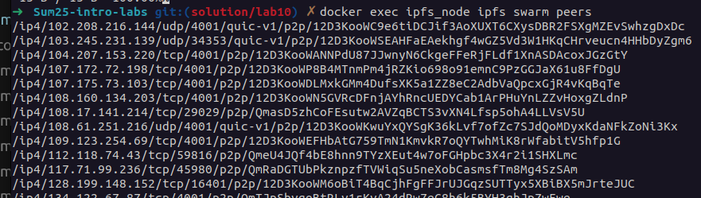
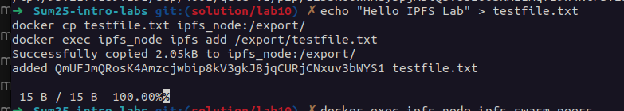
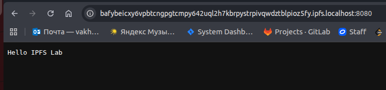
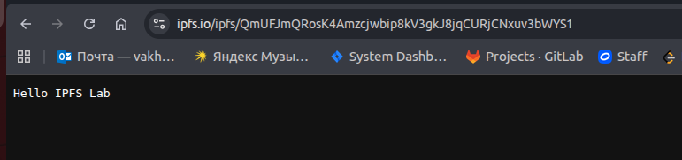
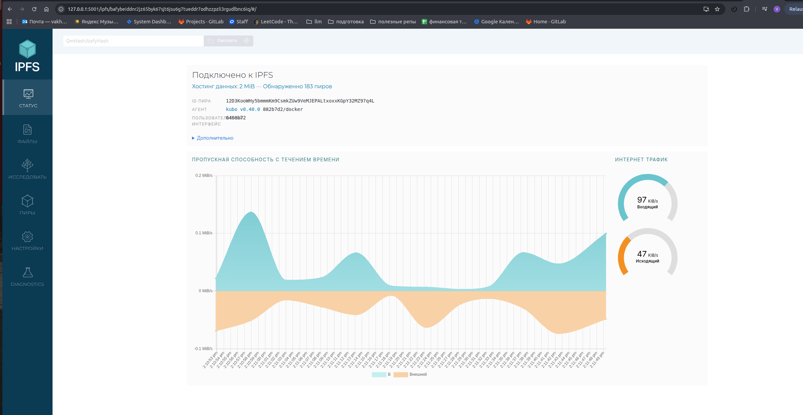

   ## Task 1 Results

   ```docker exec ipfs_node ipfs swarm peers```

   


   ```
   echo "Hello IPFS Lab" > testfile.txt
   docker cp testfile.txt ipfs_node:/export/
   docker exec ipfs_node ipfs add /export/testfile.txt
   ```

   
   

   - Via public gateways:
   

   - Open a browser and access the IPFS web UI:
   
   
   - IPFS Node Peer Count: 183

   - IPFS Node Bandwidth: In: 97Kib/s, Out: 47 Kib/s

   - Test File CID: QmUFJmQRosK4Amzcjwbip8kV3gkJ8jqCURjCNxuv3bWYS1

   - Public Gateway URL: https://ipfs.io/ipfs/QmUFJmQRosK4Amzcjwbip8kV3gkJ8jqCURjCNxuv3bWYS1


   ## Task 2 Results

   Note! Since I was doing my current work from my work network, I didn't have 4everland open, so the following screenshots will be taken from my phone (I couldn't share the mobile internet to my work laptop due to certain restrictions)

   
   


   - 4EVERLAND Project URL: https://sum25-intro-labs-nxgckyec-rakavaqaflow.ipfs.4everland.app

   - GitHub Repository (if you used your own app): https://github.com/RakaVaqaFlow/Sum25-intro-labs/tree/solution/lab10

   - IPFS CID from 4EVERLAND: bafybeihzarmfcsys5au2yx3mhemrowy2x4xg4pckz3s7rxbipa3etpsjzm
