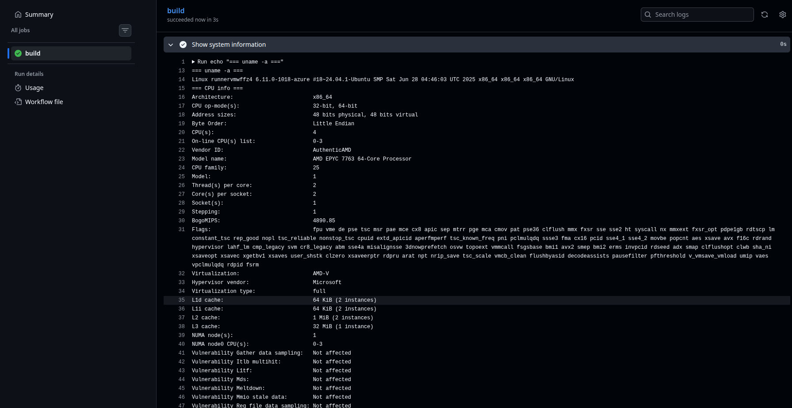

## Lab 3 — GitHub Actions (CI/CD)

## Task 1: First GitHub Actions pipeline

### 1. Key concepts I learned from the quickstart

- **GitHub Actions** lets you run automated workflows on events like `push`, `pull_request`, or manual triggers.
- A **workflow** lives in the `.github/workflows/` folder as a YAML-file.
- A workflow is made of:
  - **Events** (what triggers it, e.g. `push`),
  - **Jobs** (logical units that run on runners),
  - **Steps** (individual shell commands or actions inside a job),
  - **Actions** (reusable pieces of code, like `actions/checkout`).
- A **runner** is the virtual machine where the job runs (for example `ubuntu-latest`).

### 2. Basic workflow

I created a workflow at `.github/workflows/ci.yml`


### 3. Commands / actions I used to trigger the workflow from my local machine:

```sh
git add .github/
git commit -m "[lab3] add basic GitHub Actions workflow"
git push
```

**RESULT:**


**Summary of what I saw:**

- The workflow was triggered by a `push` to my active branch.
- `actions/checkout@v4` successfully cloned the repository into the runner.
- The final step ran `git --version` and `ls -R`, and I saw:
  - Git version printed in the logs,
  - A recursive listing of repository files.

If there were errors, I would:

- Check the step logs,
- Fix `./github/workflows/ci.yml`,
- Commit and push again to re-run the workflow.


## Task 2: Manual trigger and system information

### 1. Add manual trigger to the workflow

I updated the workflow to support manual runs via `workflow_dispatch`


### 2. Gathering system information in the workflow

Then I extended the job with an extra step to print runner system info:




### 3. Documentation of outputs and observations

After pushing this change or running it manually:

- I opened the latest workflow run in the **Actions** tab.
- In the **"Show system information"** step logs, I saw:
  - Kernel version and architecture from `uname -a`,
  - CPU model/cores from `lscpu` or `/proc/cpuinfo`,
  - Total and used memory from `free -h`,
  - Disk partitions and usage from `df -h`,
  - Distribution name and version from `/etc/os-release`.

This confirms:

- The workflow can be triggered both automatically (on `push`/`pull_request`) and manually (`workflow_dispatch`).
- I can inspect the properties of the GitHub-hosted runner and verify what environment my CI jobs run on.


