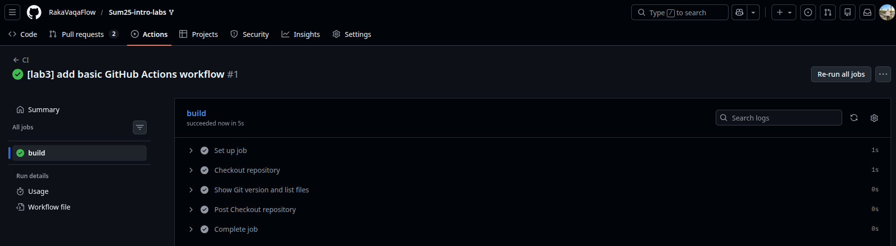

## Lab 3 — GitHub Actions (CI/CD)

## Task 1: First GitHub Actions pipeline

### 1. Key concepts I learned from the quickstart

- **GitHub Actions** lets you run automated workflows on events like `push`, `pull_request`, or manual triggers.
- A **workflow** lives in the `.github/workflows/` folder as a YAML-file.
- A workflow is made of:
  - **Events** (what triggers it, e.g. `push`),
  - **Jobs** (logical units that run on runners),
  - **Steps** (individual shell commands or actions inside a job),
  - **Actions** (reusable pieces of code, like `actions/checkout`).
- A **runner** is the virtual machine where the job runs (for example `ubuntu-latest`).

### 2. Basic workflow

I created a workflow at `.github/workflows/ci.yml`


### 3. Commands / actions I used to trigger the workflow from my local machine:

```sh
git add .github/
git commit -m "[lab3] add basic GitHub Actions workflow"
git push
```

**RESULT:**


