## Lab 4 — Operating Systems & Networking


## Task 1: Operating System Analysis

### 1.1 Boot performance

1. Analyze system boot time

```sh
systemd-analyze
systemd-analyze blame
```

**RESULT:**

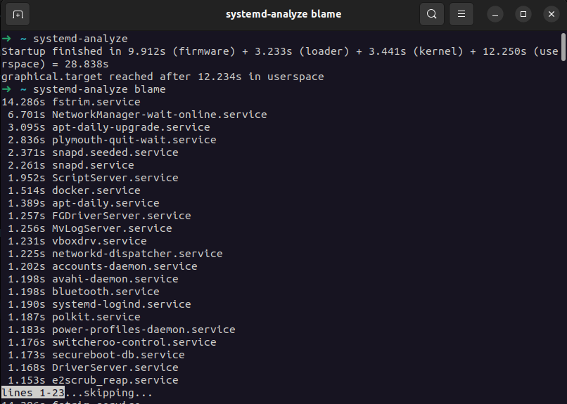

**Key observations**

- `systemd-analyze` shows the total boot time and how much time was spent in firmware, loader, kernel, and userspace.
- `systemd-analyze blame` lists services sorted by startup time; the ones at the top are the slowest and are good candidates for optimization or inspection.

2. Check system load

```sh
uptime
w
```

**RESULT:**

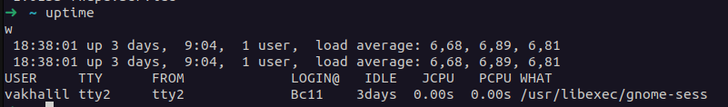

**Key observations**

- `uptime` shows how long the system has been running, current load averages, and number of logged-in users.
- `w` shows current user sessions and which commands they are running, which helps correlate load with active users and processes.


### 1.2 Process forensics

Identify resource-intensive processes

```sh
ps -eo pid,ppid,cmd,%mem,%cpu --sort=-%mem | head -n 6
ps -eo pid,ppid,cmd,%mem,%cpu --sort=-%cpu | head -n 6
```

**RESULT:**
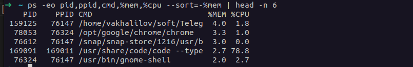
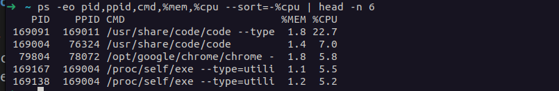

**Key observations**

- The first row in the memory-sorted list is the top memory-consuming process; long-running GUI apps (telegram, chrome, vscode).
- The first row in the CPU-sorted list is the most CPU-intensive process at the moment of measurement; short-lived tasks can spike here briefly.
- This view helps identify candidates for tuning, limiting, or moving off the host if they consume too many resources.


### 1.3 Service dependencies

Map service relationships

```sh
systemctl list-dependencies
systemctl list-dependencies multi-user.target
```

**RESULT:**
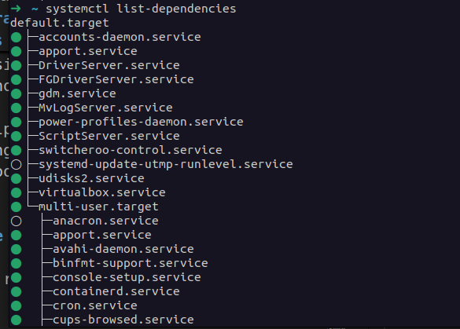
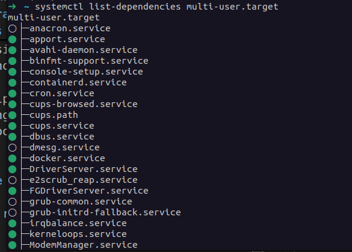


**Key observations**

- `systemctl list-dependencies` shows which units depend on others and in what tree structure, which is important for understanding boot and shutdown ordering.
- `multi-user.target` represents a typical multi-user, non-graphical system state; its dependencies show which services must be up for a standard server environment.


### 1.4 User sessions

Audit login activity

```sh
who -a
last -n 5
```

**RESULT:**

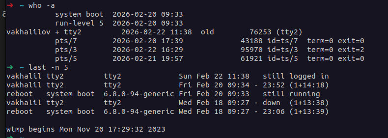

**Key observations**

- `who -a` shows currently logged-in users, terminals, and some system events (like boot time and runlevel changes).
- `last -n 5` shows recent login history, including logins, logouts, and reboots, which is useful for auditing access patterns.


### 1.5 Memory analysis

Inspect memory allocation

```sh
free -h
cat /proc/meminfo | grep -e MemTotal -e SwapTotal -e MemAvailable
```

**RESULT:**

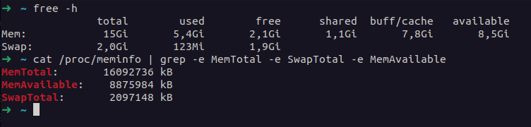

**Key observations**

- `free -h` shows total, used, and available RAM and swap; it helps detect memory pressure or excessive swapping.
- The selected `/proc/meminfo` lines confirm total physical memory, total swap, and the amount of memory that is still available for new allocations.


## Task 2: Networking Analysis

### 2.1 Network path tracing

1. Traceroute execution

```sh
traceroute github.com
```

**RESULT:**

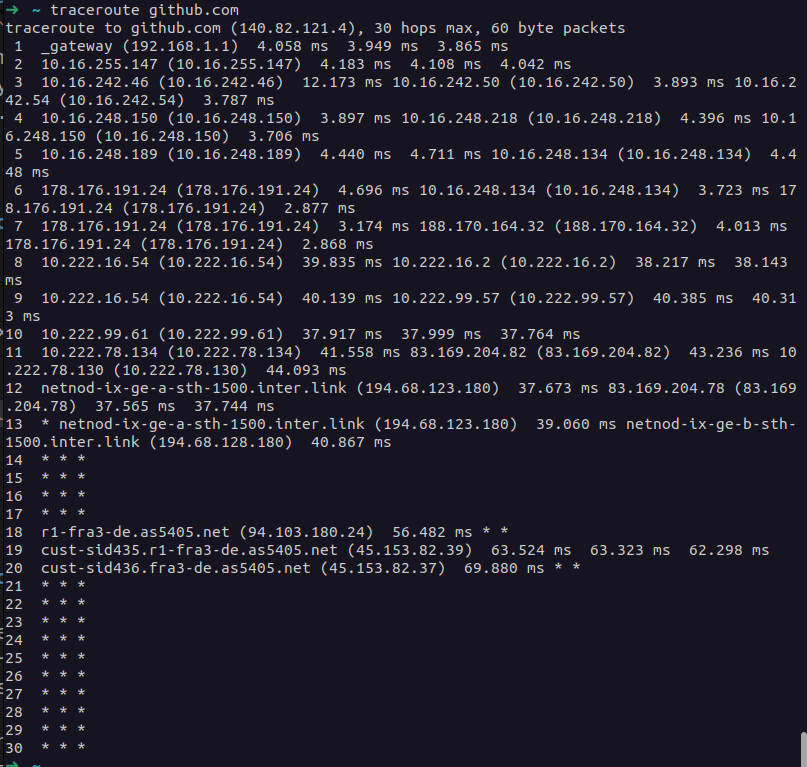

**Key observations**

- The traceroute output shows each hop between my host and GitHub, with IP addresses and round-trip times.
- Longer delays or timeouts at particular hops can indicate congestion, filtering, or routing issues on the path.

2. DNS resolution check

```sh
dig github.com
```

**RESULT:**

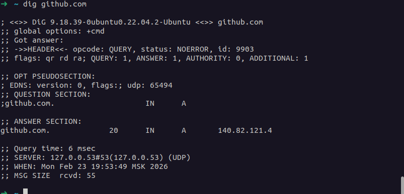

**Key observations**

- `dig` shows the DNS query and response, including the authoritative answer section and TTL values.
- I can see which IP addresses `github.com` resolves to and how long clients may cache the result.


### 2.2 Packet capture

Capture DNS traffic

```sh
sudo timeout 10 tcpdump -c 5 -i any 'port 53' -nn
```

**RESULT:**

```
tcpdump: data link type LINUX_SLL2
tcpdump: verbose output suppressed, use -v[v]... for full protocol decode
listening on any, link-type LINUX_SLL2 (Linux cooked v2), snapshot length 262144 bytes
19:56:50.237552 wlp9s0 Out IP 192.168.1.XXX.50569 > 192.168.1.YYY.53: 6268+ AAAA? example.ru. (32)
19:56:50.237624 wlp9s0 Out IP 192.168.1.XXX.36997 > 192.168.1.YYY.53: 22903+ A? example.ru. (32)
19:56:50.240773 wlp9s0 In  IP 192.168.1.YYY.53 > 192.168.1.XXX.50569: 6268 1/1/0 CNAME cname-target.ru. (117)
19:56:50.242386 wlp9s0 In  IP 192.168.1.YYY.53 > 192.168.1.XXX.36997: 22903 3/0/0 CNAME cname-target.ru., A 185.73.0.1, A 185.73.0.2 (94)
19:56:50.242714 wlp9s0 Out IP 192.168.1.XXX.53745 > 192.168.1.YYY.53: 49204+ AAAA? cname-target.ru. (36)
5 packets captured
6 packets received by filter
0 packets dropped by kernel
```

*I use placeholder domain names and XXX/YYY for addresses because the real capture falls under NDA from my job*

**Key observations**

- The capture shows the client host sending DNS queries to the local resolver (port 53) with both `AAAA` (IPv6) and `A` (IPv4) record types, and a follow-up query for the CNAME target returned by the server.
- The responses contain a `CNAME` (alias) and multiple `A` records (several IPv4 addresses), which illustrates how DNS can return aliases and multiple IPs for load balancing.
- Tcpdump reported 5 packets captured and 6 received by the filter, which is normal for a short, limit-based capture.


### 2.3 Reverse DNS

Perform PTR lookups

```sh
dig -x 8.8.4.4
dig -x 1.1.2.2
```

**RESULT:**

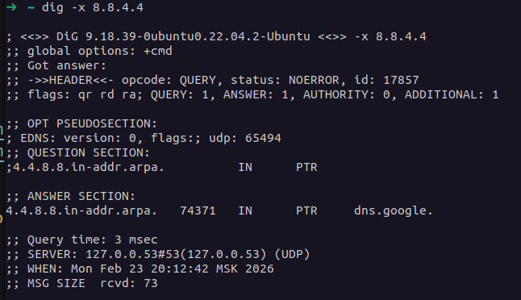
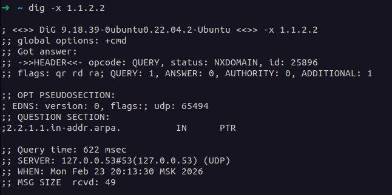


**Key observations**

- For `8.8.4.4` the reverse lookup returned a PTR record `dns.google.`, confirming that this public resolver has a proper reverse DNS entry.
- For `1.1.2.2` the reverse lookup returned `NXDOMAIN`, which means there is no PTR record defined for that address; some IPs simply do not publish reverse DNS names.
