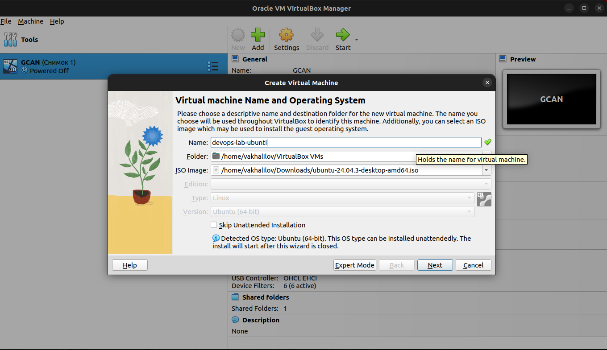
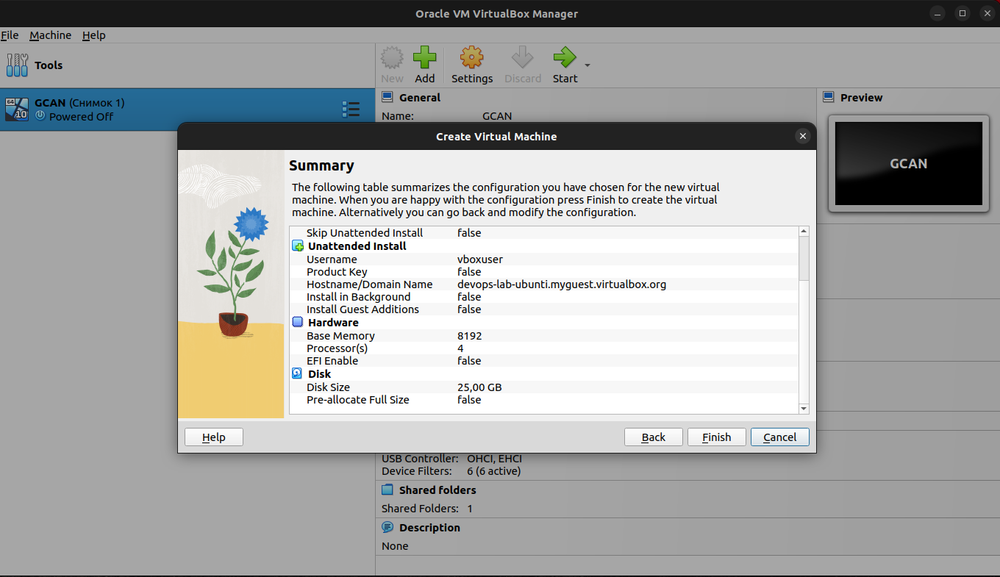
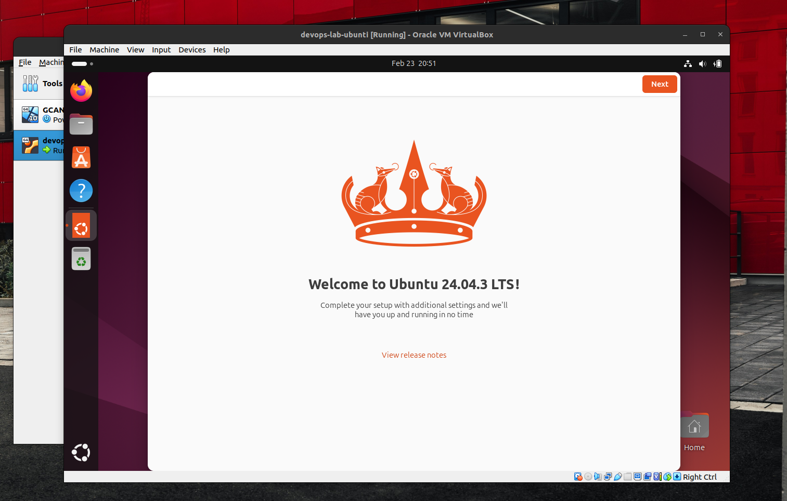
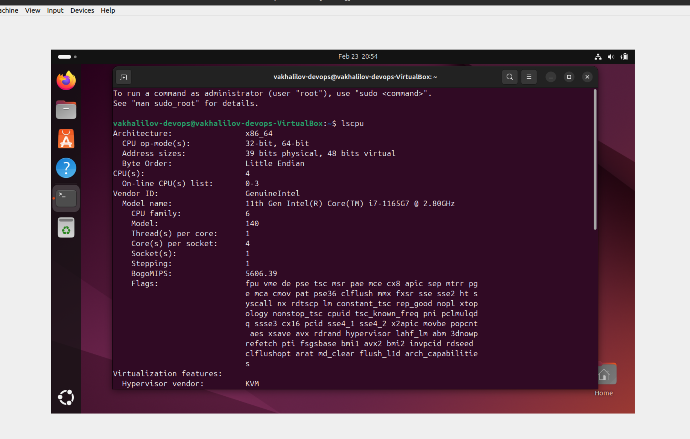
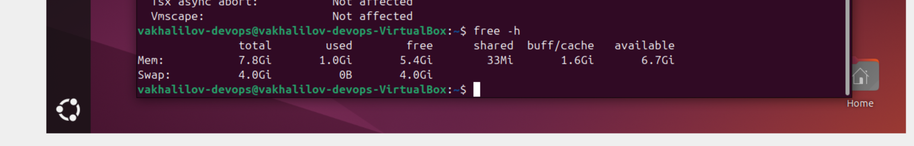
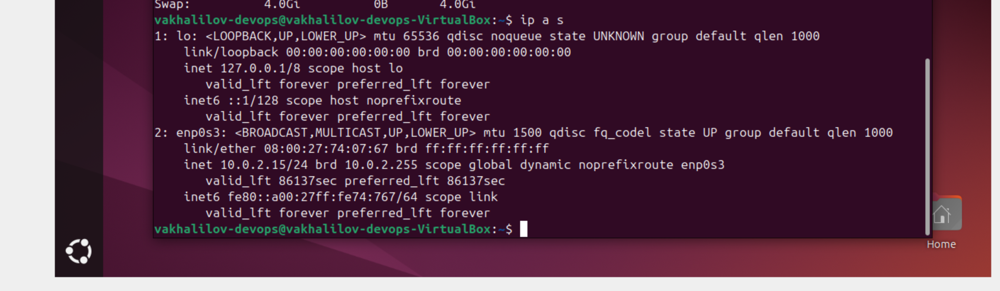
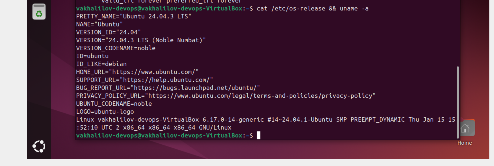

# Virtualization Lab

## Task 1: VM Deployment

**VirtualBox** was used to deploy the virtual machine.

**VirtualBox version:** 7.0.26 r168464

**Steps:**
1. Install VirtualBox from the [official website](https://www.virtualbox.org/) (But I had vbox already).
2. Create a new VM with Ubuntu24 and attach image
3. Configure: memory, CPU cores, network.

## Task 2: System Information Tools

### 1. Processor, RAM, and Network Information

**Processor:** `lscpu`

**RAM:** `free -h`

**Network:** `ip a s`

### 2. Operating System Specifications

**OS:** `cat /etc/os-release && uname -a`

