# Containers Lab — Docker

## Task 0: Image Exporting

### 1. Export Ubuntu image to a tar archive:

```sh
docker pull ubuntu:latest
docker save -o ubuntu_image.tar ubuntu:latest
ls -lh ubuntu_image.tar
docker image ls ubuntu:latest
```

**RESULT:**

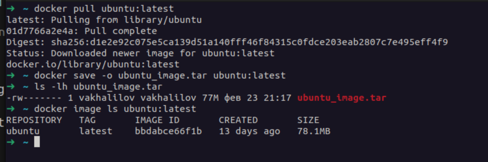

**Tar size vs image size (short explanation):**

- `docker image ls` shows the (rounded) image size as Docker reports it (sum of layer sizes in Docker storage).
- `docker save` writes layers + metadata into a tar archive, and `ls -lh` shows the actual tar file size on disk.
- A small difference like **77M vs 78.1MB** is typically caused by **rounding and different units** (MiB vs MB), plus minor metadata/packaging overhead.


## Task 1: Core Container Operations

### 1. List all containers:

```sh
docker ps -a
```

**RESULT:**
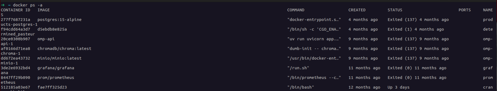


### 2. Pull Ubuntu and record image size (already done in task 0):

```sh
docker pull ubuntu:latest
docker image ls ubuntu:latest
```

**RESULT:**
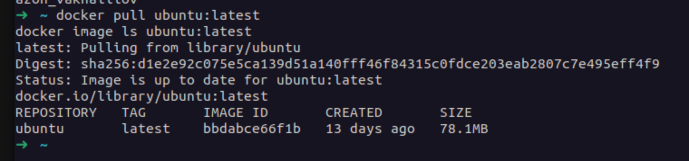

### 3. Run interactive container and exit:

```sh
docker run -it --name ubuntu_container ubuntu:latest
exit
```

**RESULT:**

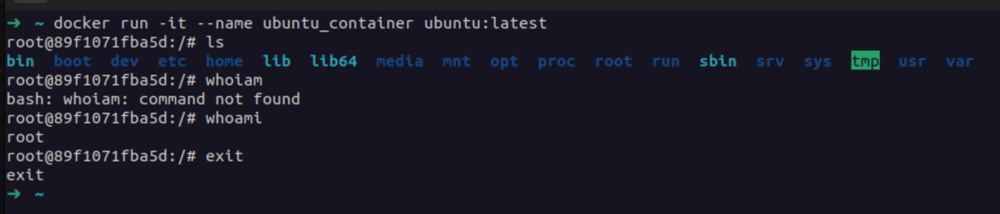

### 4. Try removing the image and explain the error:

```sh
docker rmi ubuntu:latest
```

**Error + explanation:**

```
➜  ~ docker rmi ubuntu:latest
Error response from daemon: conflict: unable to remove repository reference "ubuntu:latest" (must force) - container 89f1071fba5d is using its referenced image bbdabce66f1b

```

- Removal fails because the image is **still referenced by an existing container** (`89f1071fba5d`), even if it is stopped. We need to remove the container first (`docker rm 89f1071fba5d`) and then remove the image.

**Example:**
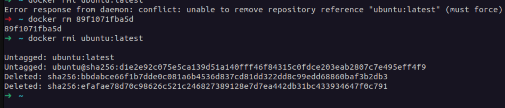


## Task 2: Image Customization

### 1. Deploy Nginx:

```sh
docker run -d -p 80:80 --name nginx_container nginx
curl localhost
```

**RESULT:**

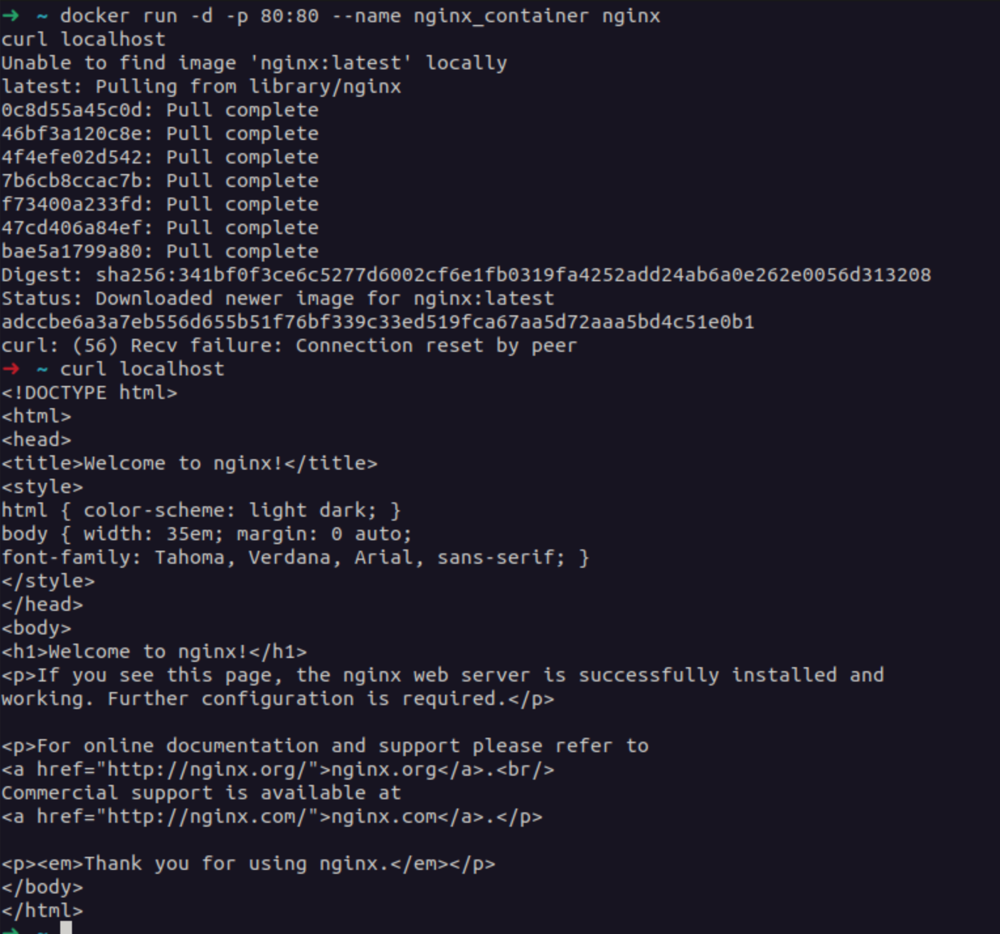

### 2. Customize website:

Create `submission/index.html`:
Copy into the container and test:

```sh
docker cp index.html nginx_container:/usr/share/nginx/html/
curl localhost
```

**RESULT:**

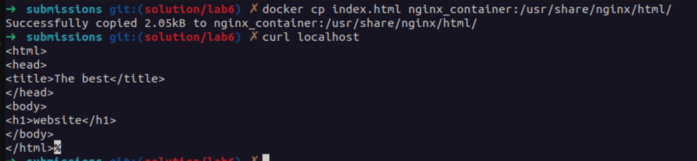

### 3. Create custom image:

```sh
docker commit nginx_container my_website:latest
docker image ls my_website:latest
```

**RESULT:**

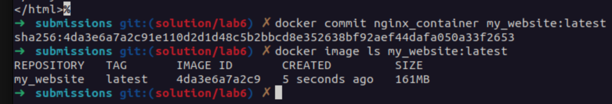

### 4. Remove original container:

```sh
docker rm -f nginx_container
docker ps -a
```

**RESULT:**
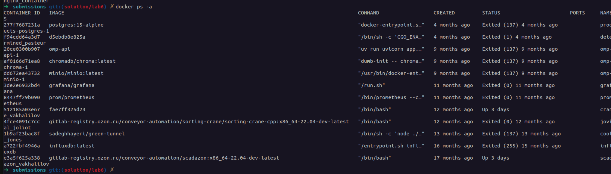

### 5. Create a new container from the custom image:

```sh
docker run -d -p 80:80 --name my_website_container my_website:latest
curl localhost
```

**RESULT:**

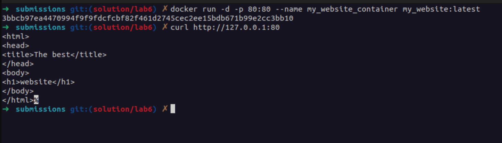

### 6. Analyze image changes with `docker diff` and explain:

```sh
docker diff my_website_container
```

**RESULT:**
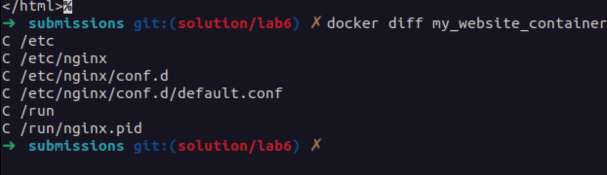


**Explanation (short):**
- `A` = added, `C` = changed, `D` = deleted files/directories compared to the original container filesystem.
- `C /etc/nginx/conf.d/default.conf`: Nginx config was modified inside the running container (often by the image entrypoint scripts on first start).
- `C /run/nginx.pid`: PID file created/updated when Nginx starts.
- Parent directories (`/etc`, `/run`, etc.) are marked as `C` because files inside them changed.


## Task 3: Container Networking

### 1. Create a bridge network:

```sh
docker network create lab_network
```

### 2. Run two Alpine containers on that network:

```sh
docker run -dit --network lab_network --name container1 alpine ash
docker run -dit --network lab_network --name container2 alpine ash
```

### 3. Test connectivity (ping by container name):

```sh
docker exec container1 ping -c 3 container2
```

**RESULT:**
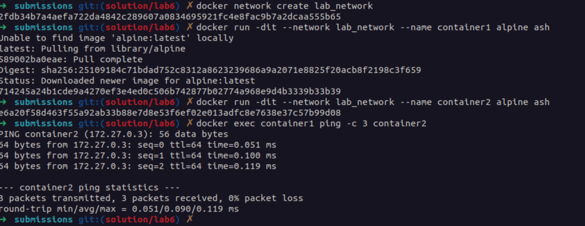


**How Docker internal DNS works (short):**
- On a `lab_network`, Docker provides an embedded DNS resolver (commonly `127.0.0.11`) inside containers.
- Container names are registered in that network, so `container2` resolves to its IP within `lab_network`.


## Task 4: Volume Persistence

### 1. Create volume:

```sh
docker volume create app_data
```

### 2. Run Nginx with the volume mounted:

```sh
docker run -d -v app_data:/usr/share/nginx/html --name web nginx
```

### 3. Copy custom content:

```sh
docker cp index.html web:/usr/share/nginx/html/
curl localhost
```

**RESULT:**

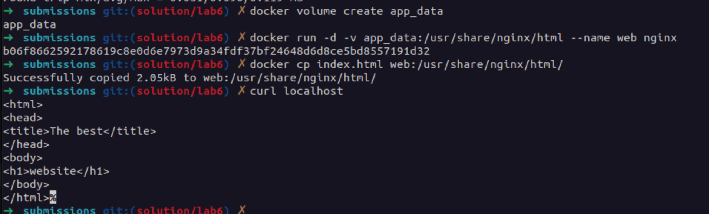

### 4. Verify persistence:

```sh
docker stop web && docker rm web
docker run -d -v app_data:/usr/share/nginx/html --name web_new nginx
curl localhost
```

**RESULT:**

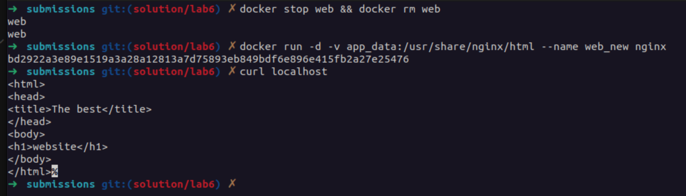


## Task 5: Container Inspection

### 1. Run Redis:

```sh
docker run -d --name redis_container redis
```

### 2. Inspect processes:

```sh
docker top redis_container
```

**RESULT:**

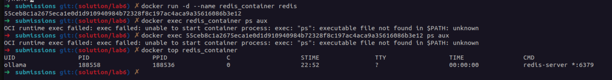
Note: I already had redis_container before this lab, so because of this we can see ollama process

### 3. Get container IP:

```sh
docker inspect -f '{{range.NetworkSettings.Networks}}{{.IPAddress}}{{end}}' redis_container
```

**RESULT:**

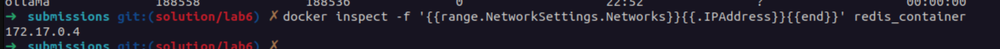

### 4. `docker exec` vs `docker attach` (comparison):
- `docker exec`: runs a **new process** inside an existing container (best for debugging, running commands, checking files).
- `docker attach`: attaches your terminal to the container’s **main process (PID 1)** stdio (useful for interactive foreground containers; can be disruptive if you send input/signals).


## Task 6: Cleanup Operations

### 1. Disk usage before cleanup:

```sh
docker system df
```

**RESULT:**

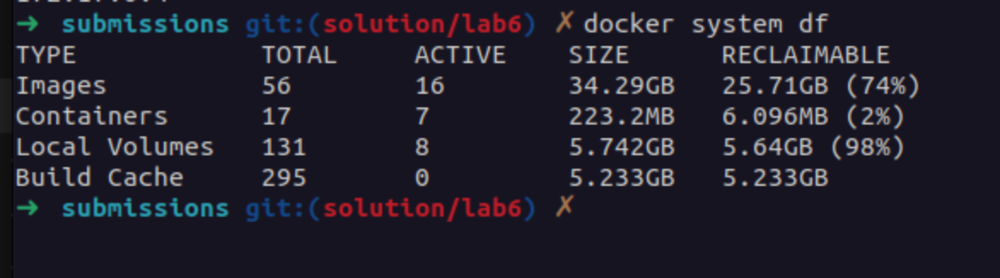

### 2. Create test objects:

```sh
for i in {1..3}; do docker run --name temp$i alpine echo "hello"; done
```

Minimal `Dockerfile` for building a test image:

```dockerfile
FROM alpine
CMD ["echo","hello"]
```

Build twice to get a dangling (`<none>`) image, then remove the tag:

```sh
docker build -t temp-image .
docker build -t temp-image .
docker rmi temp-image
```

### 3. Remove stopped containers:

```sh
docker container prune -f
```

### 4. Remove unused images:

```sh
docker image prune -a -f
```

### 5. Disk usage after cleanup + space savings:

```sh
docker system df
```

**RESULT:**

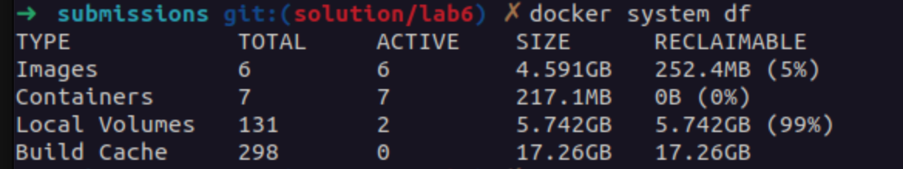

Space saved: ~17.7GB (45.49GB → 27.81GB)

