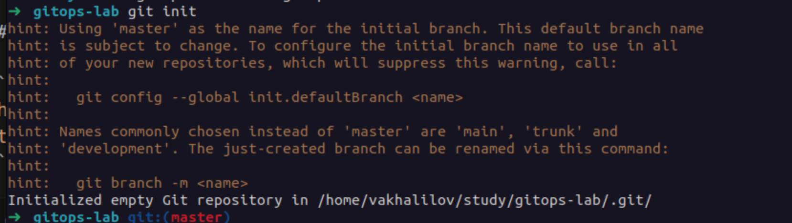
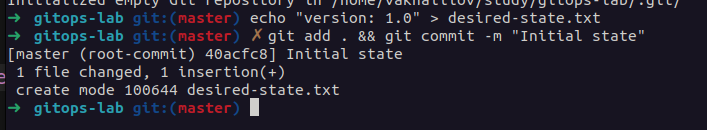
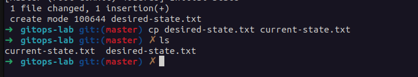
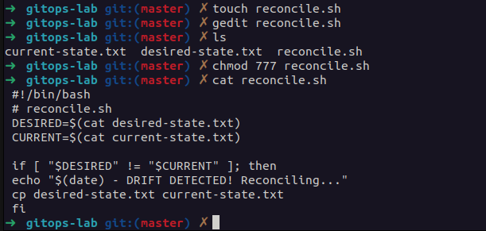
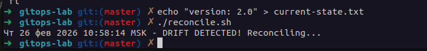
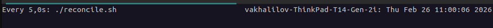
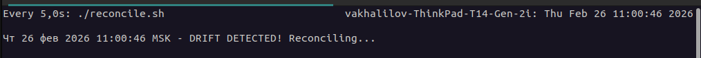
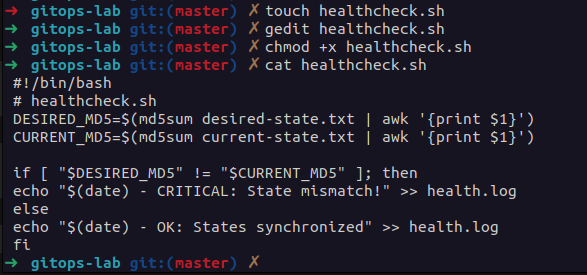
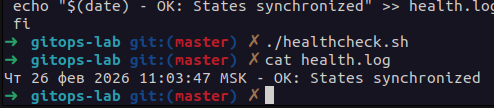
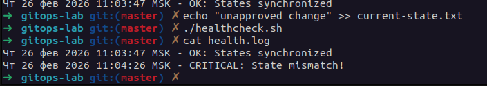

# **GitOps Fundamentals Lab**


## **Task 1: Git State Reconciliation**

**Objective**: Simulate how GitOps operators continuously synchronize cluster state with Git


Tools Used:

`git` | `watch` | `diff` | `cp`

1. **Initialize repository**:

   ```bash
   mkdir gitops-lab && cd gitops-lab
   git init
   ```
   

2. **Create desired state**:

   ```bash
   echo "version: 1.0" > desired-state.txt
   git add . && git commit -m "Initial state"
   ```

    

3. **Simulate live cluster**:

   ```bash
   cp desired-state.txt current-state.txt
   ```
   

4. **Create reconciliation script**:

   ```bash
   #!/bin/bash
   # reconcile.sh
   DESIRED=$(cat desired-state.txt)
   CURRENT=$(cat current-state.txt)
   
   if [ "$DESIRED" != "$CURRENT" ]; then
   echo "$(date) - DRIFT DETECTED! Reconciling..."
   cp desired-state.txt current-state.txt
   fi
   ```

   

5. **Trigger manual drift**:

   ```bash
   echo "version: 2.0" > current-state.txt # Simulate manual cluster change
   ```

6. **Run reconciliation**:

   ```bash
   chmod +x reconcile.sh
   ./reconcile.sh # Should detect and fix drift
   ```

   Drift detected:
    


7. **Automate reconciliation**:

   ```bash
   watch -n 5 ./reconcile.sh # Runs every 5 seconds
   ```

   
   
   After new changes:

   


---

## **Task 2: GitOps Health Monitoring**

**Objective**: Implement health checks for configuration synchronization


Tools Used:

`md5sum` | `cron` | `echo` | `date`

1. **Create health check script**:

   ```bash
   #!/bin/bash
   # healthcheck.sh
   DESIRED_MD5=$(md5sum desired-state.txt | awk '{print $1}')
   CURRENT_MD5=$(md5sum current-state.txt | awk '{print $1}')
   
   if [ "$DESIRED_MD5" != "$CURRENT_MD5" ]; then
   echo "$(date) - CRITICAL: State mismatch!" >> health.log
   else
   echo "$(date) - OK: States synchronized" >> health.log
   fi
   ```

2. **Make executable**:

   ```bash
   chmod +x healthcheck.sh
   ```
   

3. **Simulate healthy state**:

   ```bash
   ./healthcheck.sh
   cat health.log# Should show "OK"
   ```

   

4. **Create drift**:

   ```bash
   echo "unapproved change" >> current-state.txt
   ```

5. **Run health check**:

   ```bash
   ./healthcheck.sh
   cat health.log# Now shows "CRITICAL"
   ```

   

### Expected Output in `health.log`

```bash
Mon Jul 3 14:35:00 UTC 2023 - OK: States synchronized
Mon Jul 3 14:36:00 UTC 2023 - CRITICAL: State mismatch!
```

