# SRE Lab


## Task 1: Key Metrics for SRE and SLAs

**Objective**: Monitor system resources and manage disk space.

1. **Monitor System Resources**:
   - Use commands like `htop` and `iostat` to monitor CPU, memory, and I/O usage.
   - Identify and document the top 3 most consuming applications for CPU, memory, and I/O usage in a `submission8.md` file.

   ```htop```:
   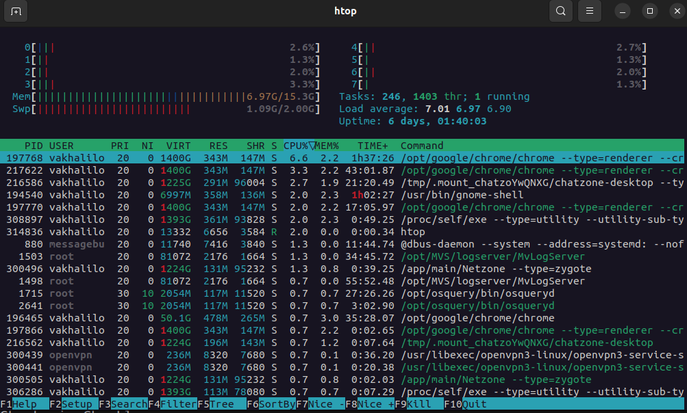

   - Top 3 most consuming applications for CPU (Google Chrome processes):
   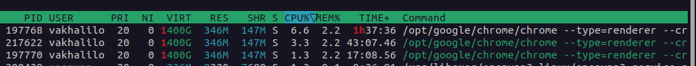

   - Top 3 most consuming applications for memory (Pycharm processes):
   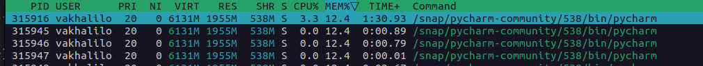


   Add IO_RATE to filters:
   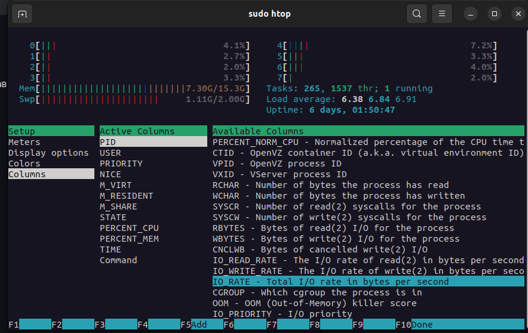

   - Top 3 most consuming applications for I/O:
   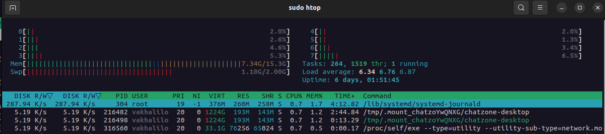
   Note: Chatzone - Mattermost in company where I work


2. **Disk Space Management**:
   - Use `du` and `df` to manage disk space.
   - Identify and log the top 3 largest files in the `/var` directory in the `submission8.md` file.

   - ```df -h```:
   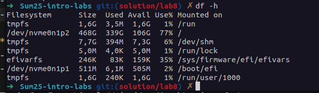

    - ```du -ah /var | sort -h | tail -n 20```:
   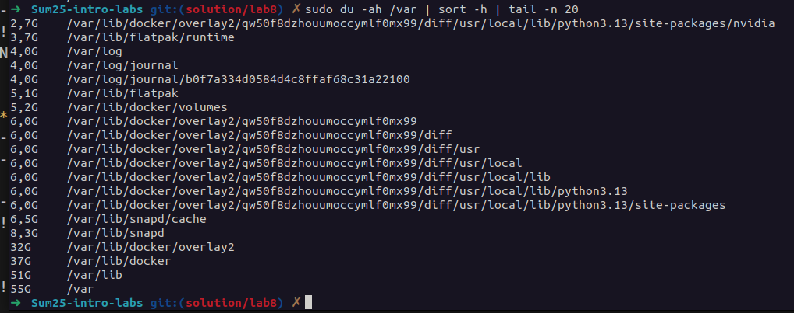

   We can see that docker is the biggest consumer of memory. These are image layers and container data, meaning historical images and unused volumes can significantly inflate disk usage.
   
   After Docker come snap and flatpak package system: /var/lib/snapd (~8.3G, of which ~6.5G is cache) and /var/lib/flatpak (~5.1G, including ~3.7G runtime).

   From the point of view of SRE and disk management, potential candidates for optimization are cleaning unused Docker images and volumes, clearing snapd and flatpak caches, as well as configuring log rotation (logrotate/journal) to prevent partition overflow/var and SLA degradation.


## Task 2: Practical Website Monitoring Setup

**Objective**: Set up real-time monitoring for any website using Checkly. You'll create checks for:

### Step 1: Choose Your Website

I choose Innopolis University site: https://innopolis.university/

Pick ANY public website you want to monitor (e.g., your favorite store, news site, or portfolio)

### Step 2: Create Checks in Checkly

1. **Sign up at [Checkly](https://checklyhq.com/)** (free account)
2. Create **API Check** for basic availability:
   - URL: Your chosen website

   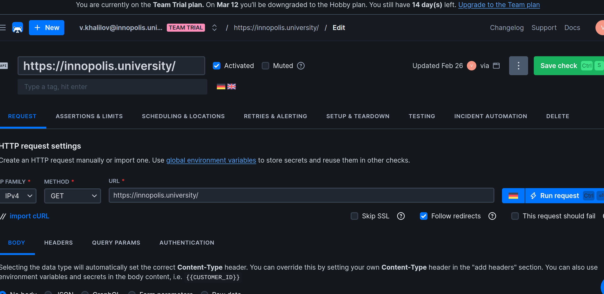

   - Assertion: Status code is 200

   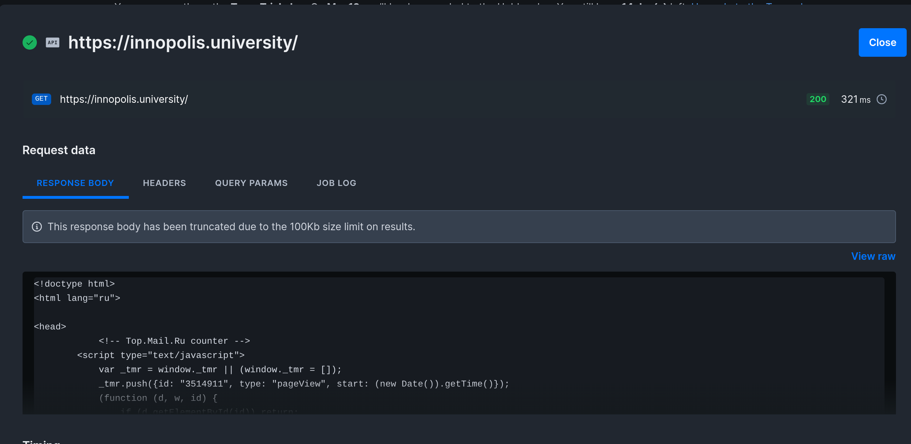
3. Create **Browser Check** for content & interactions:
   - URL: Same website

   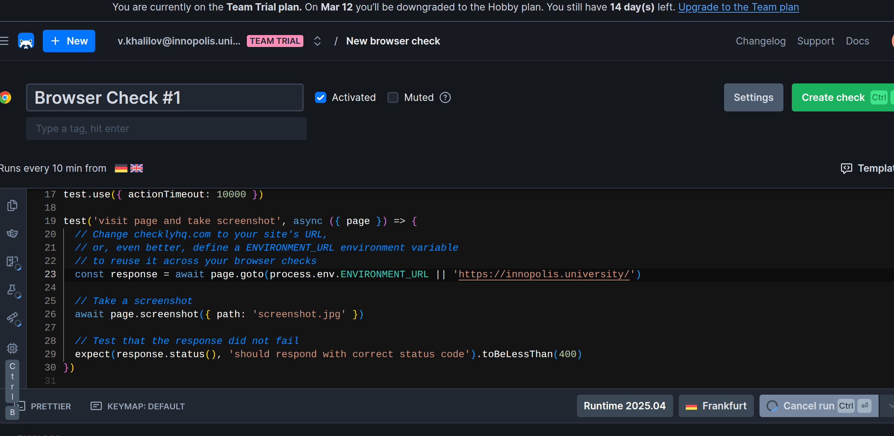
   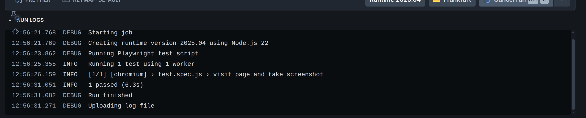
   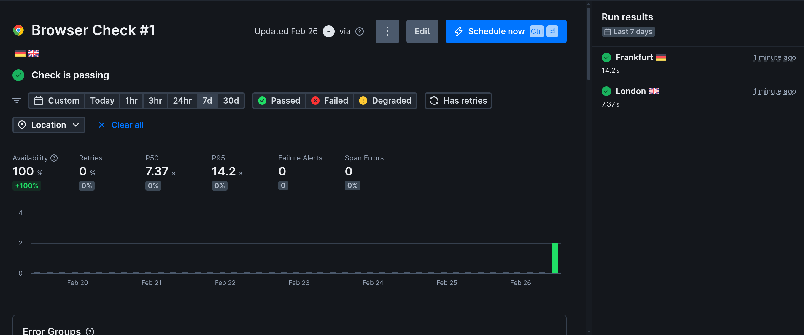

### Step 3: Set Up Alerts

Configure **alert rules** of YOUR choice:

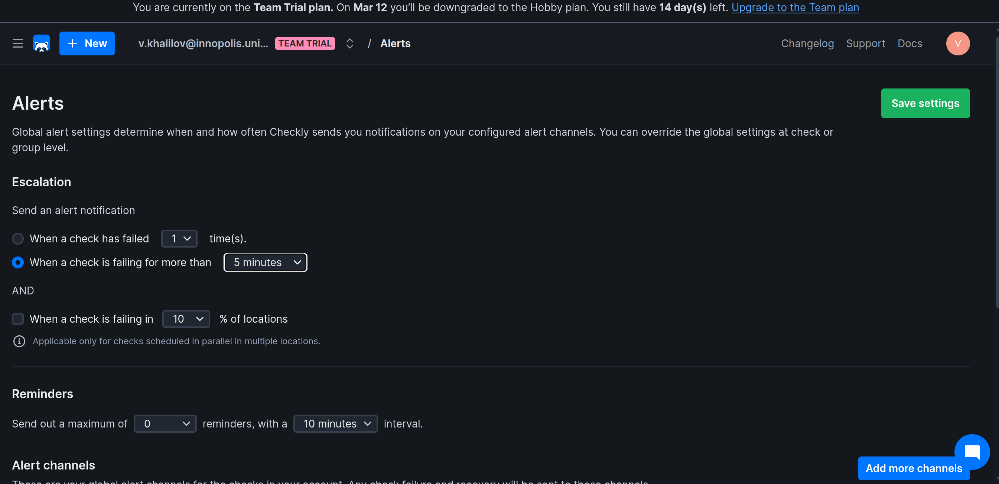
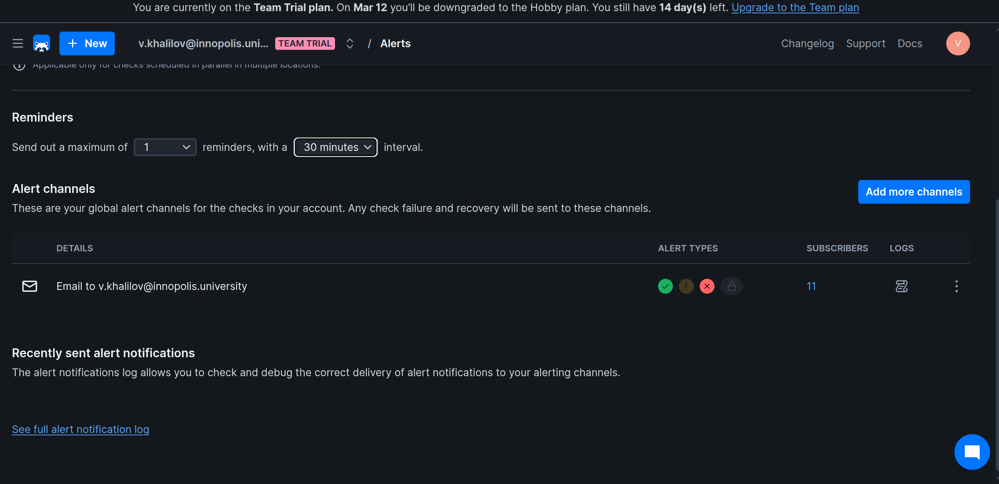
