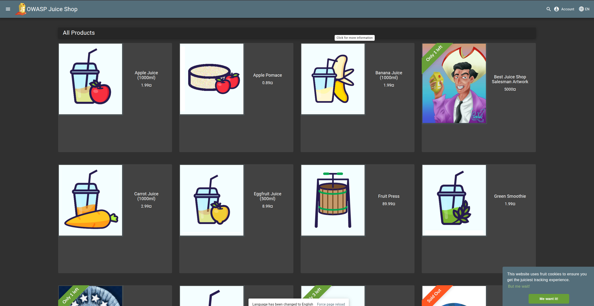
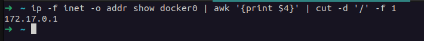
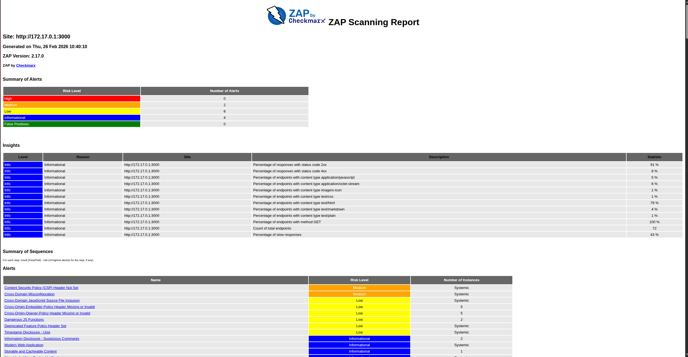
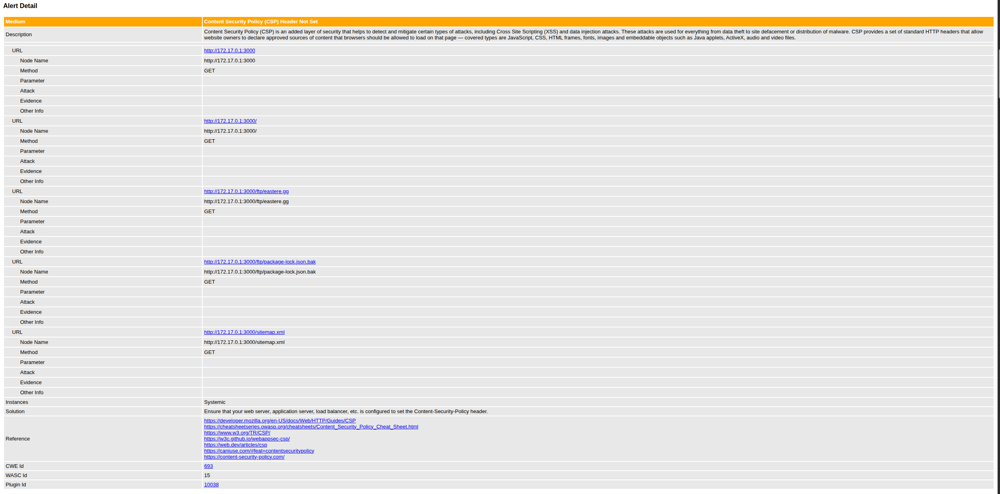
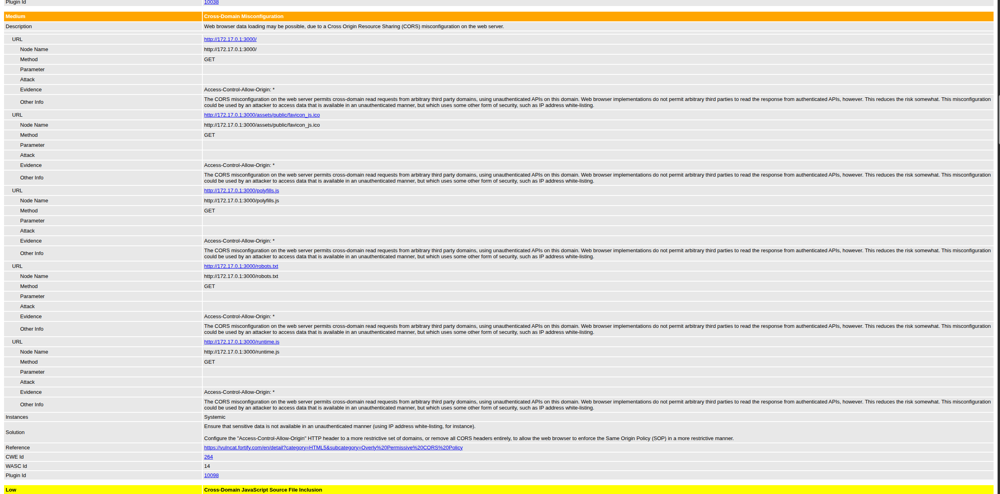
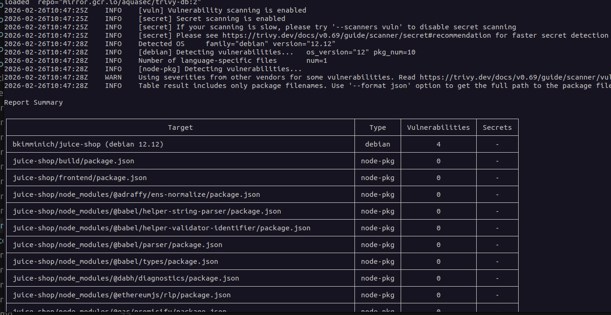

# Introduction to DevSecOps Tools

## Task 1: Web Application Scanning with OWASP ZAP

**Objective**: Perform automated security scanning of a vulnerable web application using OWASP ZAP in Docker to identify common web vulnerabilities. Web application scanning helps discover security flaws like XSS, SQL injection, and misconfigurations before attackers exploit them. ZAP is an industry-standard tool maintained by OWASP.

1. **Start the vulnerable target application** (Juice Shop):

   ```bash
      docker run -d --name juice-shop -p 3000:3000 bkimminich/juice-shop
   ```

   Verify it's running: `http://localhost:3000` in your browser:

   


2. **Scan with OWASP ZAP**:

    ```ip -f inet -o addr show docker0 | awk '{print $4}' | cut -d '/' -f 1```:

    

   ```bash
      docker run --rm -u zap -v $(pwd):/zap/wrk:rw \
      -t ghcr.io/zaproxy/zaproxy:stable zap-baseline.py \
      -t http://172.17.0.1:3000 \
      -g gen.conf \
      -r zap-report.html
   ```

   
   

   
3. **Analyze results**:
    - Find the HTML report in your current directory: `zap-report.html`

    ## Task 1 Results
 

    - 2 Medium risk vulnerabilities:

        - Content Security Policy (CSP) Header Not Set

        

        - Cross-Domain Misconfiguration

        


    - Security headers present: No. The ZAP report shows that the key Content-Security-Policy header is missing, which increases the risk of XSS and other attacks

---

## Task 2: Container Vulnerability Scanning with Trivy

**Objective**: Identify vulnerabilities in container images using Trivy executed via Docker, focusing on intentionally vulnerable images for education. Container scanning detects OS/library vulnerabilities in images before deployment. Trivy is the industry's most comprehensive open-source scanner.

1. **Scan using Trivy in Docker**:

   ```bash
      docker run --rm -v /var/run/docker.sock:/var/run/docker.sock \
      aquasec/trivy:latest image \
      --severity HIGH,CRITICAL \
      bkimminich/juice-shop
   ```

   


2. **Analyze results**:


   - Critical vulnerabilities in Juice Shop image: 10
   - Vulnerable packages:
      1. libssl3 (openssl) – CVE-2025-15467, RCE/DoS
      2. jsonwebtoken (npm пакет) – CVE-2015-9235, bypassing the JWT check
   - Dominant vulnerability type: vulnerabilities in Node.js dependencies and cryptographic libraries (openssl, jsonwebtoken, vm2, etc.), leading to remote code execution, authentication bypass, and DoS

